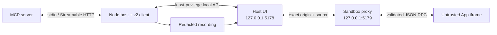

# MCP App Lab

**Make MCP App compatibility and sandbox failures visible before your users find them.**

[](https://github.com/hubugui1111-lab/mcp-app-lab/actions/workflows/ci.yml)
[](https://github.com/hubugui1111-lab/mcp-app-lab/actions/workflows/codeql.yml)
[](LICENSE)
[](package.json)

[简体中文](README.zh-CN.md) · [Fixture gallery](docs/fixtures.md) · [Security model](docs/security-model.md) · [v0.1.1 notes](docs/release-notes-v0.1.1.md)


MCP App Lab is a focused local workbench for [MCP Apps](https://github.com/modelcontextprotocol/ext-apps). It connects to a real MCP server, renders its App through a two-origin double iframe, explains conformance failures, records MCP and bridge traffic, and turns known-bad Apps into repeatable CLI and browser regressions.

It complements broad MCP inspectors. The narrow job here is App-specific evidence: **what rendered, what crossed the bridge, what policy allowed or rejected it, and whether the same behavior stays stable in CI.**

## What you get

- A live three-pane workbench: tool input, sandboxed App viewport, conformance inspector, and chronological protocol trace.
- Current MCP Core negotiation through `@modelcontextprotocol/client`, over stdio or Streamable HTTP.
- MCP Apps `2026-01-26` host behavior through the official `@modelcontextprotocol/ext-apps` bridge.
- Thirteen deterministic checks for UI URI linking, exact MIME, HTML shape, CSP declarations, sandbox isolation, visibility, permissions, and tool schemas.
- A distinct-origin double iframe with exact `event.source` and `event.origin` checks.
- Deny-by-default navigation, sanitized CSP sources, bounded resize requests, and explicit capability downgrades.
- Redacted, versioned JSON recordings with exact-input offline replay.
- Nine adversarial fixtures and Windows Chromium visual baselines.
- Strict TypeScript, lint, unit, integration, coverage, package-smoke, fixture, browser, secret, dependency, and CodeQL gates.

## Quick start

Requirements: Node.js `>=22.19.0` and npm `>=10`.

```bash
git clone https://github.com/hubugui1111-lab/mcp-app-lab.git
cd mcp-app-lab
npm ci
npm run demo
```

Open <http://127.0.0.1:5178>, change the tool arguments, and select **Run tool**. The included weather fixture is a real MCP stdio server, so discovery, resource reads, tool calls, iframe initialization, and trace updates all cross the same boundaries as an external server.

Run the headless conformance gate:

```bash
npm run build
node dist/node/cli.js test --config examples/good.config.json
node dist/node/cli.js test --config fixtures/wrong-mime.json --json
```

The second command intentionally exits `1` and reports `APP003`; a clean report exits `0`, and connection/configuration failures exit `2`.

## Test your own server

Create `my-app.config.json`:

```json
{
  "connection": {
    "transport": "stdio",
    "command": "node",
    "args": ["dist/server.js"],
    "cwd": "./my-server"
  },
  "protocolMode": "auto",
  "policy": {
    "openLinks": "allowlist",
    "allowedLinkOrigins": ["https://docs.example.com"],
    "maxFrameHeight": 1200,
    "maxFrameWidth": 1600
  }
}
```

Then choose an interface:

```bash
# Interactive workbench
node dist/node/cli.js dev --config my-app.config.json

# Machine-readable CI verdict
node dist/node/cli.js test --config my-app.config.json --json

# Offline playback of a recording exported from the workbench
node dist/node/cli.js replay mcp-app-lab-recording.json
```

`cwd` is resolved relative to the config file. HTTP endpoints must use HTTPS, except for loopback development URLs. Secret-bearing headers and environment keys are rejected; keep credentials in an external provider and never put them in arguments or committed configs.

## Architecture



The host and sandbox listeners bind to loopback. The outer sandbox proxy receives App HTML, applies a generated CSP response header, and relays only validated JSON-RPC messages. App requests return to the Node controller through a small same-host API; server credentials are never exposed to the App frame.

See [architecture](docs/architecture.md), [security model](docs/security-model.md), and [protocol support](docs/protocol-support.md) for the precise boundaries.

## Adversarial gallery

The repository ships runnable failures for wrong MIME, invalid `ui://` linking, CSP injection, schema mismatch, tool errors, malformed postMessage traffic, navigation escape, resize overflow, and unsupported display mode requests.

```bash
npm run test:fixtures
npm run demo:bad
```

Static conformance defects fail the CLI. Runtime-only behaviors are made visible as trace outcomes and are exercised by unit or browser tests. The complete expected-result matrix is in [docs/fixtures.md](docs/fixtures.md).

## Verification

```bash
npm run verify
npx playwright install chromium
npm run test:e2e
```

`npm run verify` runs formatting, lint, strict typing, isolated unit/UI tests, integration tests, coverage thresholds, both production builds, all fixture connection contracts, and a clean tarball install/CLI smoke test. Playwright then verifies the real double-iframe handshake, tool interaction, narrow layout, and both visual baselines.

The launch images are not mockups. Regenerate them from the browser suite with:

```bash
npm run test:e2e:update
npm run demo:assets
```

## Scope and limitations

- This is an independent developer tool, not an official MCP certification suite.
- v0.1.x supports stdio and Streamable HTTP. It does not implement legacy standalone SSE transport or OAuth flows.
- Sampling, elicitation, and unadvertised host capabilities are intentionally unavailable.
- Replay matches exact recorded App requests and returns saved responses; it does not reconnect to or simulate arbitrary server state.
- Runtime-only policy fixtures need a browser interaction to produce their trace event; the headless fixture gate verifies that each server still connects and its static verdict remains expected.
- The default link policy is deny. An allowlist is an explicit local testing choice, not a claim that a target is trustworthy.

## Project status

`v0.1.1` is the current public MVP. The wire formats and public Node exports may evolve before `v1.0.0`; recording schema `1.0` is validated on load and versioned independently.

- [Changelog](CHANGELOG.md)
- [v0.1.1 release notes](docs/release-notes-v0.1.1.md)
- [v0.1.0 release notes](docs/release-notes-v0.1.0.md)
- [Contributing](CONTRIBUTING.md)
- [Security policy](SECURITY.md)
- [Launch kit](docs/launch-kit.md)

Licensed under the [MIT License](LICENSE).
