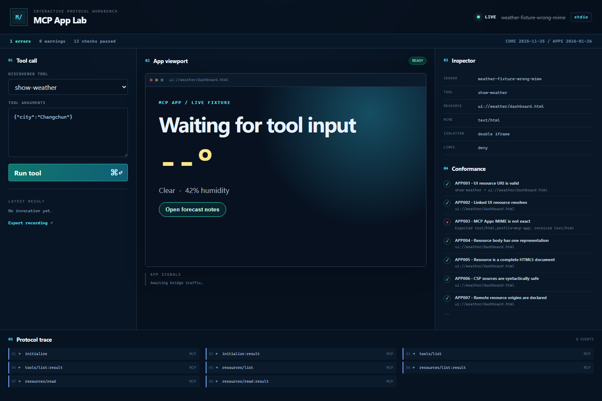
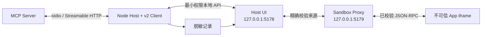

# MCP App Lab

**在用户踩坑之前，把 MCP App 的兼容性与沙箱问题明确显示出来。**

[](https://github.com/hubugui1111-lab/mcp-app-lab/actions/workflows/ci.yml)
[](https://github.com/hubugui1111-lab/mcp-app-lab/actions/workflows/codeql.yml)
[](LICENSE)
[](package.json)

[English](README.md) · [夹具说明](docs/fixtures.md) · [安全模型](docs/security-model.md) · [v0.1.1 发布说明](docs/release-notes-v0.1.1.md)



MCP App Lab 是一个面向 [MCP Apps](https://github.com/modelcontextprotocol/ext-apps) 的本地开发工作台。它连接真实 MCP Server，通过双源双 iframe 渲染 App，解释一致性失败，记录 MCP 与桥接消息，并把已知坏例子变成可重复的 CLI 和浏览器回归测试。

它不是要替代通用 MCP Inspector，而是专注于 App 开发中最难留证据的一段：**渲染了什么、桥上传了什么、策略允许或拒绝了什么，以及这些行为能否在 CI 中稳定复现。**

## 核心能力

- 三栏实时工作台：工具输入、沙箱 App、检查结果与完整协议轨迹。
- 使用 `@modelcontextprotocol/client` 通过 stdio 或 Streamable HTTP 协商当前 MCP Core。
- 使用官方 `@modelcontextprotocol/ext-apps` 桥接实现 MCP Apps `2026-01-26` Host 行为。
- 13 项确定性检查，覆盖 UI URI、精确 MIME、HTML、CSP、沙箱隔离、可见性、权限和工具 Schema。
- 不同源的双 iframe，并同时校验 `event.source` 与 `event.origin`。
- 默认拒绝跳转、CSP 源清洗、尺寸上限和显式能力降级。
- 带脱敏与版本号的 JSON 录制，以及严格输入匹配的离线回放。
- 9 个对抗夹具和 Windows Chromium 视觉基线。
- 严格 TypeScript、lint、单元、集成、覆盖率、打包冒烟、夹具、浏览器、依赖、密钥与 CodeQL 检查。

## 五分钟运行

要求 Node.js `>=22.19.0`、npm `>=10`。

```bash
git clone https://github.com/hubugui1111-lab/mcp-app-lab.git
cd mcp-app-lab
npm ci
npm run demo
```

打开 <http://127.0.0.1:5178>，修改工具参数并点击 **Run tool**。内置天气例子本身就是一个真实的 MCP stdio Server，因此发现、资源读取、工具调用、iframe 初始化和轨迹更新都会经过真实边界。

运行无界面的检查：

```bash
npm run build
node dist/node/cli.js test --config examples/good.config.json
node dist/node/cli.js test --config fixtures/wrong-mime.json --json
```

第二条命令会故意以状态码 `1` 退出并报告 `APP003`。全部通过时退出码为 `0`；配置或连接失败为 `2`。

## 检查自己的 Server

新建 `my-app.config.json`：

```json
{
  "connection": {
    "transport": "stdio",
    "command": "node",
    "args": ["dist/server.js"],
    "cwd": "./my-server"
  },
  "protocolMode": "auto",
  "policy": {
    "openLinks": "allowlist",
    "allowedLinkOrigins": ["https://docs.example.com"],
    "maxFrameHeight": 1200,
    "maxFrameWidth": 1600
  }
}
```

```bash
# 交互工作台
node dist/node/cli.js dev --config my-app.config.json

# 适合 CI 的 JSON 判定
node dist/node/cli.js test --config my-app.config.json --json

# 回放从工作台导出的记录，不再连接原 Server
node dist/node/cli.js replay mcp-app-lab-recording.json
```

`cwd` 相对配置文件解析。HTTP 地址必须使用 HTTPS，本机回环开发地址除外。配置会拒绝疑似包含密钥的 Header 和环境变量名；凭据应由外部机制提供，也不要把密钥写进参数或提交到仓库。

## 安全边界



Host 与 Sandbox 都仅监听回环地址。外层 Sandbox Proxy 接收 App HTML，通过 HTTP 响应头施加生成后的 CSP，只转发经过验证的 JSON-RPC。App 请求通过小型同主机 API 回到 Node Controller，Server 凭据不会下发到 App iframe。

精确设计见[架构](docs/architecture.md)、[安全模型](docs/security-model.md)和[协议支持矩阵](docs/protocol-support.md)。

## 对抗夹具

仓库内置错误 MIME、错误 `ui://` 链接、CSP 注入、Schema 不匹配、工具报错、非法 postMessage、导航逃逸、超大尺寸和不支持显示模式九类夹具。

```bash
npm run test:fixtures
npm run demo:bad
```

静态一致性问题会让 CLI 失败；只在运行时出现的问题会记为轨迹事件，并由单元测试或浏览器测试覆盖。完整预期见 [docs/fixtures.md](docs/fixtures.md)。

## 完整验证

```bash
npm run verify
npx playwright install chromium
npm run test:e2e
```

`npm run verify` 覆盖格式、lint、严格类型、单元/UI、集成、覆盖率阈值、两套生产构建、全部夹具连接契约，以及从干净 tarball 安装后的 CLI 冒烟测试。Playwright 继续验证真实双 iframe 握手、工具交互、窄屏布局和视觉基线。

README 图片不是设计稿，可从浏览器测试重复生成：

```bash
npm run test:e2e:update
npm run demo:assets
```

## 当前边界

- 本项目是独立开发工具，不是官方 MCP 认证套件。
- v0.1.x 支持 stdio 与 Streamable HTTP，不支持旧式独立 SSE Transport 或 OAuth 流程。
- Sampling、elicitation 和 Host 未声明的能力默认不可用。
- 回放要求 App 请求与记录精确匹配，然后返回已保存响应；不会重连 Server，也不会模拟任意服务端状态。
- 运行时策略夹具需要浏览器交互才会产生对应轨迹；无界面夹具门禁负责验证 Server 能连接且静态结果不漂移。
- 外链默认拒绝。启用白名单只是本地测试选择，不代表目标地址可信。

## 项目状态

`v0.1.1` 是当前公开 MVP。在 `v1.0.0` 前，协议适配层和公开 Node 导出仍可能调整；录制格式 `1.0` 独立版本化，并会在读取时校验。

- [更新记录](CHANGELOG.md)
- [v0.1.1 发布说明](docs/release-notes-v0.1.1.md)
- [v0.1.0 发布说明](docs/release-notes-v0.1.0.md)
- [参与贡献](CONTRIBUTING.md)
- [安全策略](SECURITY.md)
- [推广素材包](docs/launch-kit.md)

项目采用 [MIT License](LICENSE)。
