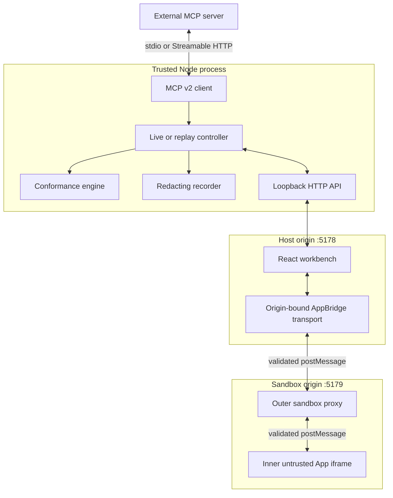

# Architecture

MCP App Lab separates protocol connectivity, host policy, and untrusted rendering so each boundary can be inspected and tested independently.

## Runtime topology

The Node process and host UI are trusted for a local development session. MCP server output and App HTML are untrusted. The outer proxy is a deliberately small enforcement component on a distinct origin.

## Live session lifecycle

1. The CLI loads and validates a JSON config. A stdio executable is started without a shell, or a Streamable HTTP URL is opened.
2. The MCP v2 client negotiates the core protocol and discovers tools and resources.
3. The session inspector resolves every tool-linked `ui://` resource and runs the static App contract checks.
4. Two loopback HTTP listeners start: the host workbench and the separate sandbox origin.
5. The host creates the outer sandbox iframe with its exact expected host origin and generated CSP metadata.
6. The proxy creates the inner App iframe. Parent/proxy/App messages are checked for exact source, origin, and JSON-RPC 2.0 shape.
7. `AppBridge` performs the Apps initialization sequence. Its handlers call a least-privilege local API for tools, resources, policy decisions, and trace recording.
8. The recorder redacts each payload before it is made exportable.

The CLI owns both listeners and the MCP connection. `SIGINT` and `SIGTERM` close all three.

## Package boundaries

- `src/core`: config parsing, contracts, conformance, security decisions, session inspection, and deterministic recording/replay. It has no React dependency.
- `src/node`: SDK transport adapter, controllers, local HTTP API, dual-origin servers, and CLI.
- `src/ui`: React workbench, host API client, and host-side AppBridge handlers.
- `src/sandbox`: outer proxy bootstrap and message relay.
- `examples`: a small real MCP Apps server with selectable variants.
- `fixtures`: public adversarial configs that drive the example server.
- `tests`: unit, UI, integration, CLI, fixture, E2E, and visual evidence.

`src/node/index.ts` is the public programmatic surface. Everything else should be treated as internal until v1.

## Compatibility seam

The current MCP packages have two release lines. `@modelcontextprotocol/client@2` negotiates current MCP Core, while `@modelcontextprotocol/ext-apps@1` still uses the v1 SDK peer for its bridge types and runtime helpers. MCP App Lab does not cast one client into the other.

Instead:

- the Node connection uses the v2 client;
- the browser host creates `AppBridge` in manual-handler mode;
- explicit local API handlers translate App requests to the Node controller;
- the v1 SDK remains an isolated peer dependency of the official Apps package and fixture server.

This split is visible in [protocol-support.md](protocol-support.md) and can be removed cleanly when the official Apps bridge adopts the v2 client.

## Record and replay

A recording contains:

- independent recording, MCP Core, and MCP Apps schema/version fields;
- non-secret server and connection labels;
- ordered events with layer, direction, method, correlation ID, outcome, and redacted payload;
- a session snapshot sufficient to rebuild the workbench offline.

Replay is intentionally strict. It searches forward for the next matching App request, compares canonical JSON values, and returns the recorded response. A changed request raises `ReplayMismatchError` instead of silently returning unrelated data. Live browser traffic cannot mutate a replay recording.

## Design decisions

### Two origins instead of `srcdoc`

The sandbox proxy is served from a second origin because a same-origin convenience frame would hide an important production boundary and make origin regressions impossible to test.

### Origin-bound transport

The host transport validates exact sender and receiver origins and never uses a wildcard target. This behavior is small enough to unit test and is also exercised in Chromium.

### Policy decisions are trace events

Navigation denial, resize clamping, invalid messages, and display-mode downgrade are observable outcomes. A developer should not have to infer policy behavior from a missing UI reaction.

### Local-only listener

Both servers bind to `127.0.0.1`. There is intentionally no `--host 0.0.0.0` shortcut in v0.1.0.
